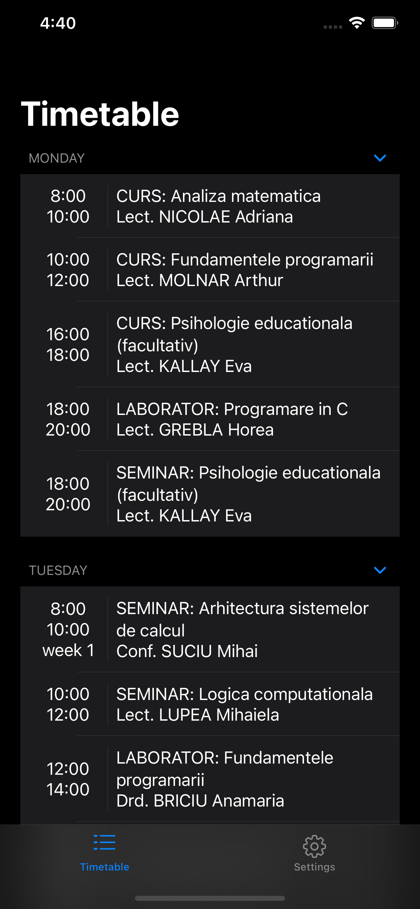
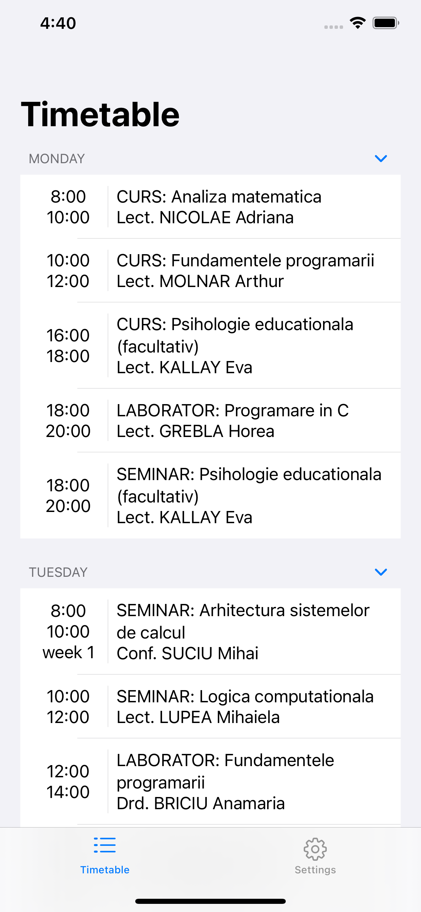

# UBB app
Currently only for the CS section

# Done:
- [x] Basic view structure with support for dark/light mode
- [x] Timetable

# To do:
- [ ] Better integration with the OS
    - [ ] Widgets
    - [ ] Notifications
    - [ ] Siri intents
- [ ] Grades
- [ ] News
- [ ] ?

# Screenshots:

